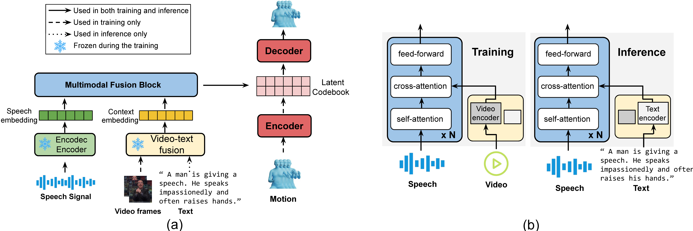

# T3M: Text Guided 3D Human Motion Synthesis from Speech[NAACL 2024]
This repository contains the PyTorch implementation of the "T3M: Text Guided 3D Human Motion Synthesis from Speech" project. The goal of this project is to synthesize realistic 3D human motion based on both speech and text inputs.



## Environment Setup

To get started with this project, you will need to set up a Python environment using `miniconda3`. Follow the steps below to create the required environment:
### Prerequisites

- Python 3.10
- [Miniconda3](https://docs.anaconda.com/miniconda/)

### Creating the Environment

1. Install Miniconda3 if you haven't done so already.
2. Create a new conda environment named `t3m` with Python 3.10 and install the dependencies:
   ```bash
   conda create -n t3m python=3.10
   conda activate t3m
   pip install torch==2.0.1 torchvision==0.15.2 torchaudio==2.0.2 --index-url https://download.pytorch.org/whl/cu118
   pip install -r requirements.txt
   ```

## Usage
To use this project, follow these steps:

1. Clone the repository:
    ```bash
    git clone https://github.com/Gloria2tt/T3M.git
    cd T3M
2. Download the dataset and pre-trained weight:
    
    We provide an enhanced approach compared to the original papers by utilizing a more advanced video-text alignment model, [InternVid](https://github.com/OpenGVLab/InternVideo/tree/main/Data/InternVid), to extract video embeddings from the SHOW dataset.

    - Download the SHOW dataset:
    Download the Talkshow dataset from [this link](https://download.is.tue.mpg.de/download.php?domain=talkshow&resume=1&sfile=SHOW_dataset_v1.0.zip) and unzip the folder.

    - In addition to audio and pose data, the original video is also required for training. Download the original video following instructions from the [SHOW repository](https://github.com/yhw-yhw/SHOW?tab=readme-ov-file).

    - Extract the audio-aligned segments from the video based on the file names, and use the video encoder from InternVid to extract the video embeddings. We recommend performing this step on A100 or H100 GPUs.

    - Following the instructions in the TalkSHOW repository, download the pre-trained face model and VQ-VAE model from [this](https://drive.google.com/file/d/1bC0ZTza8HOhLB46WOJ05sBywFvcotDZG/view), as our paper modifies only the body and hand generation parts.
    - I've noticed that the SHOW repository no longer contains the original videos. Therefore, we've established a new repository to facilitate the download of the preprocessed dataset, which you can find [here](https://huggingface.co/Wenshuo1/t3m_dataset/tree/main)

### Train
To train the model, you need to modify the body_pixel.json configuration file to match your environment:

- If this is your first time running the code, set the dataset_load_mode option from pickle to json.
Adjust the vq_path option to match the location of your folder.

- Adjust the vq_path option to match the location of your folder.

Finally, use the following command to start training:
    
    sh train_body_pixel.sh


### Visualize

1. To visualize the results after training, ensure you have ffmpeg installed:

        sudo apt-get install ffmpeg
2. Run the visualization script:

        bash visualise.sh
3. Alternatively, you can visualize a specific audio file:

        python scripts/demo.py --config_file ./config/body_pixel.json --infer --audio_file your/voice/file

    makesure you have changed the model path correctly.

## Citation
If you find our work interesting, please consider citing:

    @inproceedings{peng2024t3m,
    title={T3M: Text Guided 3D Human Motion Synthesis from Speech},
    author={Peng, Wenshuo and Zhang, Kaipeng and Zhang, Sai Qian},
    booktitle={Findings of the Association for Computational Linguistics: NAACL 2024},
    pages={1168--1177},
    year={2024}
    }
    
## Acknowledgement
Our code is built upon [TalkSHOW](https://github.com/yhw-yhw/TalkSHOW) and [SHOW](https://github.com/yhw-yhw/SHOW). We specifically thanks [Hongwei Yi](https://xyyhw.top/) for sharing their codebase.

## Contact
Any questions just send me an email(gin2pws@gmail.com) directly.

